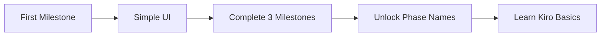
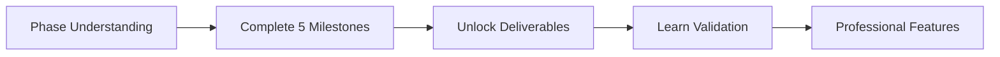
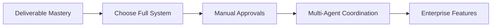

# Progressive Kiro Revelation System

## Overview

The Progressive Revelation System gradually introduces kiro workflow complexity as users gain experience with milestones. This ensures beginners aren't overwhelmed while providing a smooth upgrade path to advanced features.

## Revelation Levels

### Level 0: Hidden Kiro (Quickstart Default)
**User Experience**: Simple phases with friendly names
**Kiro Reality**: Full kiro workflow running underneath
**Visibility**: No kiro terminology visible

```yaml
user_sees:
  phases: ["Foundation", "Core Features", "Polish", "Launch"]
  progress: "Simple percentage bar"
  
kiro_underneath:
  phases: ["design", "spec", "task", "execute"]
  weights: [15, 25, 20, 40]
  auto_approval: true
```

### Level 1: Phase Names (After 3 Milestones)
**Trigger**: User completes 3 quickstart milestones successfully
**Revelation**: Kiro phase names become visible
**New Features**: Phase-weighted progress shown

```yaml
user_now_sees:
  phases: ["Design (15%)", "Spec (25%)", "Task (20%)", "Execute (40%)"]
  progress: "Phase-weighted progress bar"
  terminology: "Basic kiro concepts introduced"
```

### Level 2: Deliverables (After 5 Milestones)
**Trigger**: User completes 5 milestones or asks about deliverables
**Revelation**: Phase deliverables become visible
**New Features**: Deliverable tracking and validation

```yaml
user_now_sees:
  deliverables: true
  validation_gates: "visible but auto-approved"
  phase_transitions: "shown with explanations"
```

### Level 3: Full Kiro (User Choice)
**Trigger**: User explicitly enables full kiro features
**Revelation**: Complete kiro workflow visible
**New Features**: Manual approvals, full visualization, enterprise features

```yaml
user_now_sees:
  full_kiro_dashboard: true
  manual_approvals: true
  advanced_analytics: true
  multi_agent_coordination: true
```

## Implementation Functions

```bash
# Track user progress for revelation triggers
track_revelation_progress() {
    local milestone_id=$1
    local user_level_file=".milestones/.user_level"
    
    # Count completed milestones
    local completed_count=$(count_completed_milestones)
    
    # Check revelation triggers
    if [ "$completed_count" -ge 3 ] && [ "$(get_revelation_level)" -eq 0 ]; then
        trigger_level_1_revelation
    elif [ "$completed_count" -ge 5 ] && [ "$(get_revelation_level)" -eq 1 ]; then
        trigger_level_2_revelation
    fi
}

# Get current revelation level
get_revelation_level() {
    local level_file=".milestones/.revelation_level"
    if [ -f "$level_file" ]; then
        cat "$level_file"
    else
        echo "0"  # Default to hidden
    fi
}

# Trigger Level 1 revelation
trigger_level_1_revelation() {
    echo "1" > .milestones/.revelation_level
    
    cat << EOF

🎉 MILESTONE ACHIEVEMENT UNLOCKED! 🎉

You've completed 3 milestones! You're ready for more insights.

🆕 NEW FEATURES UNLOCKED:
  ✅ Kiro Phase Names - See the 4-phase methodology
  ✅ Phase Weights - Understand progress calculation
  ✅ Phase Transitions - Track phase progression

These features are now visible in your milestone dashboards.
Want to learn more? Run: /milestone/help --kiro-phases

EOF
}

# Trigger Level 2 revelation
trigger_level_2_revelation() {
    echo "2" > .milestones/.revelation_level
    
    cat << EOF

🌟 ADVANCED FEATURES UNLOCKED! 🌟

You've mastered 5 milestones! Time for professional features.

🆕 NEW FEATURES UNLOCKED:
  ✅ Deliverable Tracking - Monitor phase deliverables
  ✅ Validation Gates - See approval requirements
  ✅ Advanced Metrics - Deep performance analytics

Ready for the full system? Run: /milestone/upgrade --full-kiro

EOF
}

# Apply revelation level to display
apply_revelation_display() {
    local milestone_id=$1
    local level=$(get_revelation_level)
    
    case "$level" in
        0)
            # Hidden kiro - show simple progress
            display_simple_progress "$milestone_id"
            ;;
        1)
            # Show phase names
            display_phase_progress "$milestone_id"
            ;;
        2)
            # Show deliverables
            display_deliverable_progress "$milestone_id"
            ;;
        3)
            # Full kiro dashboard
            visualize_kiro_workflow "$milestone_id"
            ;;
    esac
}

# Progressive feature activation
activate_progressive_features() {
    local level=$(get_revelation_level)
    
    # Set environment based on level
    case "$level" in
        0)
            export KIRO_SHOW_PHASES=false
            export KIRO_SHOW_DELIVERABLES=false
            export KIRO_AUTO_APPROVAL=true
            ;;
        1)
            export KIRO_SHOW_PHASES=true
            export KIRO_SHOW_DELIVERABLES=false
            export KIRO_AUTO_APPROVAL=true
            ;;
        2)
            export KIRO_SHOW_PHASES=true
            export KIRO_SHOW_DELIVERABLES=true
            export KIRO_AUTO_APPROVAL=false
            ;;
        3)
            export KIRO_SHOW_PHASES=true
            export KIRO_SHOW_DELIVERABLES=true
            export KIRO_AUTO_APPROVAL=false
            export KIRO_FULL_FEATURES=true
            ;;
    esac
}
```

## User Journey Mapping

### Beginner Journey (Levels 0→1)


### Intermediate Journey (Levels 1→2)


### Advanced Journey (Levels 2→3)


## Progressive UI Examples

### Level 0 Display (Hidden Kiro)
```
Personal Project: Build Portfolio Site
Progress: ████████░ 67%

✅ Foundation (Complete)
🔄 Core Features (In Progress)
⏳ Polish (Not Started)
⏳ Launch (Not Started)
```

### Level 1 Display (Phase Names)
```
Personal Project: Build Portfolio Site
Progress: ████████░ 67% (Kiro-Weighted)

✅ Design Phase (15%) - Complete
🔄 Spec Phase (25%) - In Progress
⏳ Task Phase (20%) - Not Started
⏳ Execute Phase (40%) - Not Started
```

### Level 2 Display (Deliverables)
```
Personal Project: Build Portfolio Site
Progress: ████████░ 67% (Kiro-Weighted)

📐 DESIGN PHASE (15%) ✅
  ✓ Project Blueprint
  ✓ Architecture Diagram
  ✓ Resource Planning

📋 SPEC PHASE (25%) 🔄
  ✓ Technical Specification
  ⚠ API Documentation (In Progress)
  ○ Test Strategy (Pending)

📝 TASK PHASE (20%) ⏳
  ○ Implementation Tasks
  ○ Code Reviews
  ○ Testing Tasks

🚀 EXECUTE PHASE (40%) ⏳
  ○ Deployment
  ○ Documentation
  ○ Handover
```

## Upgrade Prompts

### Contextual Upgrade Suggestions
```bash
# After completing milestone at Level 0
suggest_upgrade_to_level_1() {
    echo "💡 TIP: You're doing great! Ready to see how phases work?"
    echo "   Run: /milestone/reveal --phases"
}

# After struggling with task organization
suggest_deliverable_tracking() {
    echo "💡 TIP: Having trouble organizing tasks?"
    echo "   Deliverable tracking might help!"
    echo "   Run: /milestone/reveal --deliverables"
}

# After asking about advanced features
suggest_full_system() {
    echo "💡 TIP: Interested in advanced features?"
    echo "   The full kiro system offers:"
    echo "   • Multi-agent coordination"
    echo "   • Enterprise dashboards"
    echo "   • Advanced analytics"
    echo "   Run: /milestone/upgrade --full"
}
```

## Manual Revelation Controls

```bash
# Allow users to manually control revelation level
/milestone/reveal --phases        # Jump to Level 1
/milestone/reveal --deliverables  # Jump to Level 2
/milestone/reveal --full         # Jump to Level 3
/milestone/reveal --reset        # Reset to Level 0

# Check current level
/milestone/reveal --status
```

## Success Metrics

### Revelation Effectiveness
- **Adoption Rate**: Percentage of users progressing to each level
- **Time to Level**: Average time to reach each revelation level
- **Feature Usage**: Which revealed features are actually used
- **User Satisfaction**: Feedback on progressive complexity

### Target Metrics
- **70%** of users reach Level 1 (phase names)
- **40%** of users reach Level 2 (deliverables)
- **20%** of users reach Level 3 (full system)
- **<5%** of users feel overwhelmed at any level

## Integration with Templates

Each quickstart template respects the revelation level:

```bash
# Personal template checks revelation
create_personal_milestone() {
    local level=$(get_revelation_level)
    
    if [ "$level" -eq 0 ]; then
        # Hide kiro completely
        export KIRO_SHOW_PHASES=false
    elif [ "$level" -ge 1 ]; then
        # Show phase names
        export KIRO_SHOW_PHASES=true
    fi
    
    # Continue with milestone creation...
}
```

This progressive system ensures users learn kiro workflow naturally through experience rather than being overwhelmed upfront.